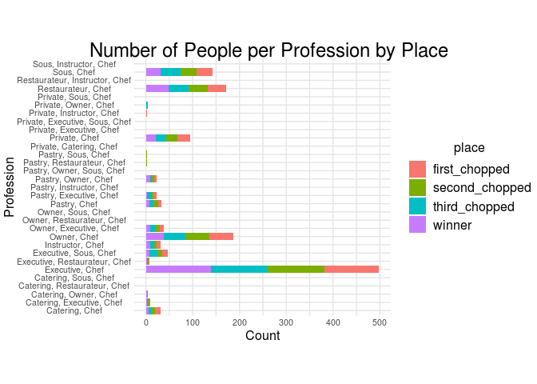
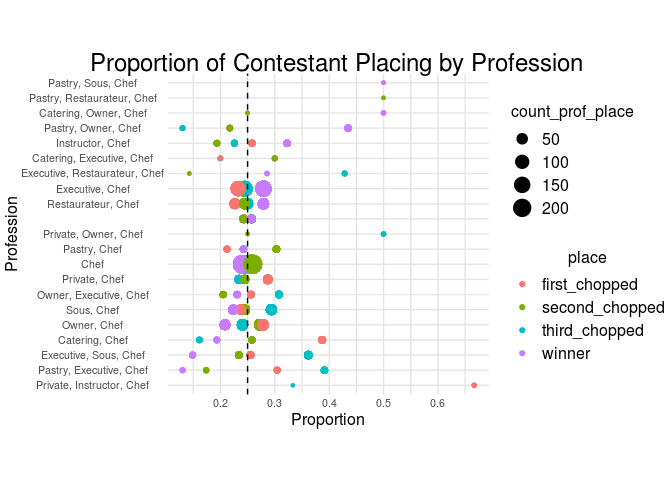
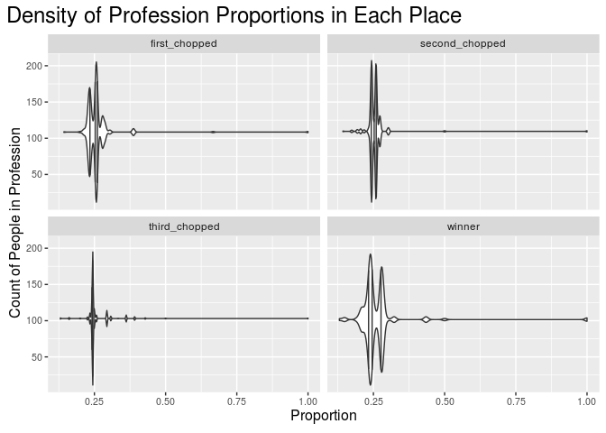

Final Report on Chopped Analysis
================
Alana Huitric and Annabelle Platt

# Chopped: Profession or Chance?

<!-- ------------------------------------ -->

## Question

<!-- ------------------------------------ -->

The chefs who participate in Chopped come from a wide variety of cooking
backgrounds, from private chefs to home cooks to sous chefs at fancy
retaurants. In this analysis, we will investigate the question of
whether chefs with more formal training are more likely to win Chopped,
or if it is an even playing field.

## Background

<!-- ------------------------------------ -->

Chopped is a TV show on the Food Network. In each episode four chefs
compete in three rounds, the appetizer, entree, and dessert rounds, with
one being eliminated, or “chopped”, each round. The last chef left
standing wins. The catch is that at the beginning of each round, the
contestants are given a basket containing ingredients they must
incorporate into their dish. These can range from relatively common
ingredients, such as bok choy, cream cheese, or strawberries, to much
wilder ones, such as gummy fried eggs. The ingredients can also
sometimes be challenging to incorporate into the particular dish. A
common example of this is all the dessert ingredients being savory.
Failure to incorporate a mandatory ingredient into their dish will most
likely result in a chef being chopped.

## Dataset

<!-- ------------------------------------ -->

The data we are using was scraped from the Chopped pages on IMDB. For
each episode it contains who the four contestants were, the order in
which they were eliminated, information about the contestants’
profession, the three judges for that episode, the ingredients for each
round, and the episode rating. We also have metadata including season,
season episode, and overall series episode. This data can be acquired by
running the `get_raw_data` script in this repository. We have also
included the resulting data in the `/data` folder.

``` r
library(tidyverse)
```

    ## ── Attaching packages ───────────────────────────────────────────────────────────────────────────────── tidyverse 1.3.0 ──

    ## ✓ ggplot2 3.3.2     ✓ purrr   0.3.4
    ## ✓ tibble  3.0.3     ✓ dplyr   1.0.2
    ## ✓ tidyr   1.1.2     ✓ stringr 1.4.0
    ## ✓ readr   1.4.0     ✓ forcats 0.5.0

    ## ── Conflicts ──────────────────────────────────────────────────────────────────────────────────── tidyverse_conflicts() ──
    ## x dplyr::filter() masks stats::filter()
    ## x dplyr::lag()    masks stats::lag()

``` r
library(stringr)
library(modelr)
library(stats)

filename = "./data/chopped.csv"
chopped_df <- read_csv(filename)
```

    ## Warning: Missing column names filled in: 'X1' [1]

    ## Warning: Duplicated column names deduplicated: 'X1' => 'X1_1' [2]

    ## 
    ## ── Column specification ──────────────────────────────────────────────────────────────────────────────────────────────────
    ## cols(
    ##   .default = col_character(),
    ##   X1 = col_double(),
    ##   X1_1 = col_double(),
    ##   season = col_double(),
    ##   season_episode = col_double(),
    ##   series_episode = col_double(),
    ##   episode_rating.x = col_double(),
    ##   episode_rating.y = col_double()
    ## )
    ## ℹ Use `spec()` for the full column specifications.

``` r
chopped_df %>% glimpse()
```

    ## Rows: 569
    ## Columns: 24
    ## $ X1               <dbl> 1, 2, 3, 4, 5, 6, 7, 8, 9, 10, 11, 12, 13, 14, 15, 1…
    ## $ X1_1             <dbl> 1, 2, 3, 4, 5, 6, 7, 8, 9, 10, 11, 12, 13, 14, 15, 1…
    ## $ season           <dbl> 1, 1, 1, 1, 1, 1, 1, 1, 1, 1, 1, 1, 1, 2, 2, 2, 2, 2…
    ## $ season_episode   <dbl> 1, 2, 3, 4, 5, 6, 7, 8, 9, 10, 11, 12, 13, 1, 2, 3, …
    ## $ series_episode   <dbl> 1, 2, 3, 4, 5, 6, 7, 8, 9, 10, 11, 12, 13, 14, 15, 1…
    ## $ episode_rating.x <dbl> 9.2, 8.8, 8.9, 8.5, 8.8, 8.5, 8.8, 9.0, 8.9, 8.8, 8.…
    ## $ episode_name     <chr> "Octopus, Duck, Animal Crackers", "Tofu, Blueberries…
    ## $ episode_notes    <chr> "This is the first episode with only three official …
    ## $ air_date         <chr> "January 13, 2009", "January 20, 2009", "January 27,…
    ## $ judge1           <chr> "Marc Murphy", "Aarón Sánchez", "Aarón Sánchez", "Sc…
    ## $ judge2           <chr> "Alex Guarnaschelli", "Alex Guarnaschelli", "Alex Gu…
    ## $ judge3           <chr> "Aarón Sánchez", "Marc Murphy", "Marc Murphy", "Geof…
    ## $ appetizer        <chr> "baby octopus, bok choy, oyster sauce, smoked paprik…
    ## $ entree           <chr> "duck breast, green onions, ginger, honey", "daikon,…
    ## $ dessert          <chr> "prunes, animal crackers, cream cheese", "phyllo dou…
    ## $ contestant1      <chr> "Summer Kriegshauser", "Raymond Jackson", "Margaritt…
    ## $ contestant1_info <chr> "Private Chef and Nutrition Coach  New York  NY", "P…
    ## $ contestant2      <chr> "Perry Pollaci", "Klaus Kronsteiner", "Rachelle Rodw…
    ## $ contestant2_info <chr> "Private Chef and Sous chef  Bar Blanc  New York  NY…
    ## $ contestant3      <chr> "Katie Rosenhouse", "Christopher Jackson", "Chris Bu…
    ## $ contestant3_info <chr> "Pastry Chef  Olana Restaurant  New York  NY", "Exec…
    ## $ contestant4      <chr> "Sandy Davis", "Pippa Calland", "Andre Marrero", "Ei…
    ## $ contestant4_info <chr> "Catering Chef  Showstoppers Catering at Union Theol…
    ## $ episode_rating.y <dbl> 9.0, 8.5, 8.7, 8.4, 8.7, 8.4, 8.8, 8.9, 8.8, 8.6, 8.…

## Uncertainty

<!-- ------------------------------------ -->

Because the data we are using is the entire population of Chopped
episodes, rather than a sample, there is no uncertainty in our data.

## Analysis

<!-- ------------------------------------ -->

``` r
theme_common <- function() {
  theme_minimal() %+replace%
  theme(
    axis.text.x = element_text(size = 8),
    axis.text.y = element_text(size = 8),
    axis.title.x = element_text(margin = margin(2, 2, 2, 2), size = 12),
    axis.title.y = element_text(margin = margin(2, 2, 2, 2), size = 12, angle = 90),

    legend.title = element_text(size = 12),
    legend.text = element_text(size = 12),

    strip.text.x = element_text(size = 12),
    strip.text.y = element_text(size = 12),

    panel.grid.major = element_line(color = "grey90"),
    panel.grid.minor = element_line(color = "grey90"),

    aspect.ratio = 4 / 4,

    plot.margin = unit(c(t = +0, b = +0, r = +0, l = +0), "cm"),
    plot.title = element_text(size = 18),
    plot.title.position = "plot",
    plot.subtitle = element_text(size = 16),
    plot.caption = element_text(size = 12)
  )
}
```

Before we could do analysis, there was a lot of data-wrangling to do.
This is contained in the next few chunks.

``` r
# Make dataframe of only chef names 
df_chef <- chopped_df %>% 
  pivot_longer(
    names_to = "Number",
    values_to = "Chef_Name",
    cols = c(contestant1, contestant2, contestant3, contestant4),
  ) %>% 
  select("Chef_Name","Number","series_episode") 

# Make dataframe of chef info
df_info <- chopped_df %>% 
  pivot_longer(
    names_to = "num",
    values_to = "Info",
    cols = c(contestant1_info, contestant2_info, contestant3_info, contestant4_info),
  ) %>% 
  select("num", "Info")

# Combine chef names and info
df_chef_info_raw <- 
  bind_cols(
    df_chef, df_info
  ) %>% 
  select("Chef_Name", "Info", "series_episode", "num")

df_chef
```

    ## # A tibble: 2,276 x 3
    ##    Chef_Name           Number      series_episode
    ##    <chr>               <chr>                <dbl>
    ##  1 Summer Kriegshauser contestant1              1
    ##  2 Perry Pollaci       contestant2              1
    ##  3 Katie Rosenhouse    contestant3              1
    ##  4 Sandy Davis         contestant4              1
    ##  5 Raymond Jackson     contestant1              2
    ##  6 Klaus Kronsteiner   contestant2              2
    ##  7 Christopher Jackson contestant3              2
    ##  8 Pippa Calland       contestant4              2
    ##  9 Margaritte Malfy    contestant1              3
    ## 10 Rachelle Rodwell    contestant2              3
    ## # … with 2,266 more rows

``` r
df_info
```

    ## # A tibble: 2,276 x 2
    ##    num            Info                                                          
    ##    <chr>          <chr>                                                         
    ##  1 contestant1_i… Private Chef and Nutrition Coach  New York  NY                
    ##  2 contestant2_i… Private Chef and Sous chef  Bar Blanc  New York  NY           
    ##  3 contestant3_i… Pastry Chef  Olana Restaurant  New York  NY                   
    ##  4 contestant4_i… Catering Chef  Showstoppers Catering at Union Theological Sem…
    ##  5 contestant1_i… Private Caterer and Culinary Instructor  Westchester County  …
    ##  6 contestant2_i… Chef de cuisine  Liberty National Golf Course  Jersey City  NJ
    ##  7 contestant3_i… Executive Chef and Owner  Ted and Honey  Brooklyn  NY         
    ##  8 contestant4_i… Owner and Chef  Chef for Hire LLC  Newville  PA               
    ##  9 contestant1_i… Executive Chef and Co-owner  La Palapa  New York  NY          
    ## 10 contestant2_i… Chef de cuisine  SoHo Grand Hotel  New York  NY               
    ## # … with 2,266 more rows

``` r
df_chef_info_raw
```

    ## # A tibble: 2,276 x 4
    ##    Chef_Name      Info                                  series_episode num      
    ##    <chr>          <chr>                                          <dbl> <chr>    
    ##  1 Summer Kriegs… Private Chef and Nutrition Coach  Ne…              1 contesta…
    ##  2 Perry Pollaci  Private Chef and Sous chef  Bar Blan…              1 contesta…
    ##  3 Katie Rosenho… Pastry Chef  Olana Restaurant  New Y…              1 contesta…
    ##  4 Sandy Davis    Catering Chef  Showstoppers Catering…              1 contesta…
    ##  5 Raymond Jacks… Private Caterer and Culinary Instruc…              2 contesta…
    ##  6 Klaus Kronste… Chef de cuisine  Liberty National Go…              2 contesta…
    ##  7 Christopher J… Executive Chef and Owner  Ted and Ho…              2 contesta…
    ##  8 Pippa Calland  Owner and Chef  Chef for Hire LLC  N…              2 contesta…
    ##  9 Margaritte Ma… Executive Chef and Co-owner  La Pala…              3 contesta…
    ## 10 Rachelle Rodw… Chef de cuisine  SoHo Grand Hotel  N…              3 contesta…
    ## # … with 2,266 more rows

``` r
convert_to_name <- function(x, name) {
  case_when(
    x == TRUE ~ name,
    x == FALSE ~ NA_character_,
  )
}

convert_to_place <- function(x) {
  case_when(
    x == "contestant1_info" ~ "first_chopped",
    x == "contestant2_info" ~ "second_chopped",
    x == "contestant3_info" ~ "third_chopped",
    x == "contestant4_info" ~ "winner"
  )
}

df_chef_info_process <- df_chef_info_raw %>%
  separate(
    col = Info,
    sep = -2,
    into = c("Info","State"),
  ) %>% 
  # Find profession based on string matching
  mutate(
    Private = str_count(Info,"Private") != 0,
    Pastry = str_count(Info,"Pastry")!= 0,
    Catering = str_count(Info, "Catering")!= 0,
    Owner = str_count(Info, "Owner") != 0,
    Executive = str_count(Info, "Executive")!= 0,
    Sous = str_count(Info, "Sous") != 0,
    Restaurateur = str_count(Info, "Restaurateur") != 0,
    Instructor = str_count(Info, "Instructor") != 0,
    IsChef = str_count(Info, "")!= 0
  ) %>% 
  mutate(
    Private = convert_to_name(Private, "Private"),
    Pastry = convert_to_name(Pastry, "Pastry"),
    Catering = convert_to_name(Catering, "Catering"),
    Owner = convert_to_name(Owner, "Owner"),
    Executive = convert_to_name(Executive, "Executive"),
    Sous = convert_to_name(Sous, "Sous"),
    Restaurateur = convert_to_name(Restaurateur, "Restaurateur"),
    Instructor = convert_to_name(Instructor, "Instructor"),
    IsChef = convert_to_name(IsChef, "Chef"),
    place = convert_to_place(num)
  ) %>% 
  unite(
    col = "Profession",
    sep = ", ",
    c(Private, Pastry, Catering, Owner, Executive, Sous, Restaurateur, Instructor, IsChef),
    na.rm = TRUE
  ) %>% 
  select(-Info, -num)
  
df_chef_info_process
```

    ## # A tibble: 2,276 x 5
    ##    Chef_Name          State series_episode Profession               place       
    ##    <chr>              <chr>          <dbl> <chr>                    <chr>       
    ##  1 Summer Kriegshaus… NY                 1 Private, Chef            first_chopp…
    ##  2 Perry Pollaci      NY                 1 Private, Sous, Chef      second_chop…
    ##  3 Katie Rosenhouse   NY                 1 Pastry, Chef             third_chopp…
    ##  4 Sandy Davis        NY                 1 Catering, Chef           winner      
    ##  5 Raymond Jackson    NY                 2 Private, Instructor, Ch… first_chopp…
    ##  6 Klaus Kronsteiner  NJ                 2 Chef                     second_chop…
    ##  7 Christopher Jacks… NY                 2 Owner, Executive, Chef   third_chopp…
    ##  8 Pippa Calland      PA                 2 Owner, Chef              winner      
    ##  9 Margaritte Malfy   NY                 3 Executive, Chef          first_chopp…
    ## 10 Rachelle Rodwell   NY                 3 Chef                     second_chop…
    ## # … with 2,266 more rows

The following graph shows the raw number of people who entered

``` r
df_chef_info_process %>% 
  filter(Profession != "Chef") %>% 
  drop_na() %>% 
  filter(Profession != "") %>% 
  #mutate(Profession = fct_reorder(Profession, ) %>% 
  
  ggplot(aes(Profession, fill = place)) +
  geom_bar() +
  theme_common() + 
  ggtitle("Number of People per Profession by Place") + 
  labs(y = "Count") + 
  coord_flip()
```

<!-- -->

Just looking at the raw counts, the distribution of contestant placings
is approximately equal within each profession. We will now examine this
with proportion instead of raw counts.

``` r
df_prof_prop <- df_chef_info_process %>% 
  group_by(Profession) %>% 
  mutate(
    count_prof = n()
  ) %>% 
  ungroup() %>% 
  group_by(Profession, place) %>% 
  mutate(
    count_prof_place = n(),
    prof_prop = count_prof_place/count_prof,
  ) %>% 
  ungroup()

df_prof_prop %>% glimpse
```

    ## Rows: 2,276
    ## Columns: 8
    ## $ Chef_Name        <chr> "Summer Kriegshauser", "Perry Pollaci", "Katie Rosen…
    ## $ State            <chr> "NY", "NY", "NY", "NY", "NY", "NJ", "NY", "PA", "NY"…
    ## $ series_episode   <dbl> 1, 1, 1, 1, 2, 2, 2, 2, 3, 3, 3, 3, 4, 4, 4, 4, 5, 5…
    ## $ Profession       <chr> "Private, Chef", "Private, Sous, Chef", "Pastry, Che…
    ## $ place            <chr> "first_chopped", "second_chopped", "third_chopped", …
    ## $ count_prof       <int> 94, 1, 33, 31, 3, 841, 39, 187, 498, 841, 94, 841, 4…
    ## $ count_prof_place <int> 27, 1, 8, 6, 2, 218, 12, 39, 116, 218, 22, 202, 116,…
    ## $ prof_prop        <dbl> 0.2872340, 1.0000000, 0.2424242, 0.1935484, 0.666666…

``` r
df_prop_graph <- df_prof_prop %>%
  filter(prof_prop != 1) %>% 
  mutate(
    Profession = fct_reorder(
      Profession, 
      if_else(place == "winner", prof_prop, -1),
      .fun = max
      )
    ) %>%
  
  ggplot(aes(Profession, prof_prop, color = place, size = count_prof_place)) +
  geom_point() + 
  coord_flip() + 
  ggtitle("Proportion of Contestant Placing by Profession") + 
  labs(y = "Proportion") + 
  geom_hline(yintercept = .25, linetype = 2) + 
  theme_common()

df_prop_graph
```

<!-- -->

This graph shows us that in most professions, the proportion of winners
falls between about 0.2 and about 0.3, centered around 0.25, which is
what we would expect to see profession had no impact on place in the
competition. There are a few winning proportions that lie outside of
this range.

The size of the points shows us that for proportions outside this range,
the number of people in those professions drastically decreased. This
suggests they may be a statistical fluke, and we would need more
competitors to get a more accurate proportion for that profession. If
only a small number of contestants from a particular profession have
competed, they will skew the overall proportion of winners in their
profession (high if they win, low if they lose). This is why we filtered
out professions with perfect winning proportions - because they
contained only one or two people.

Interestingly, we can that as proportions get further from the expected
0.25 value, the count of people in that profession decreases and the
points for each place get closer together. This implies that for
professions with larger numbers of contestants, the distribution of
places is uniform. The proportion for each place in each profession
should, as the number of contestants in the profession grows, should
approach 0.25 if profession has no impact on place, and this seems to be
what we see here.

``` r
df_prof_prop %>% 
  
  ggplot(aes(count_prof_place, prof_prop)) + 
  geom_violin(draw_quantiles = c(.25, .5, .75)) + 
  coord_flip() +
  facet_wrap(~place) + 
  ggtitle("Density of Profession Proportions in Each Place") + 
  theme(
    plot.title = element_text(size = 18),
    plot.title.position = "plot",
    
    axis.text.x = element_text(size = 8),
    axis.text.y = element_text(size = 8),
    axis.title.x = element_text(margin = margin(2, 2, 2, 2), size = 12),
    axis.title.y = element_text(margin = margin(2, 2, 2, 2), size = 12, angle = 90),
  ) + 
  labs(y = "Proportion", x = "Count of People in Profession")
```

    ## Warning in regularize.values(x, y, ties, missing(ties), na.rm = na.rm):
    ## collapsing to unique 'x' values
    
    ## Warning in regularize.values(x, y, ties, missing(ties), na.rm = na.rm):
    ## collapsing to unique 'x' values
    
    ## Warning in regularize.values(x, y, ties, missing(ties), na.rm = na.rm):
    ## collapsing to unique 'x' values
    
    ## Warning in regularize.values(x, y, ties, missing(ties), na.rm = na.rm):
    ## collapsing to unique 'x' values

<!-- -->

This graph supports the observations made from the graph above. For each
proportion, we can see the combined count of contestants from each
profession. Because the data in each case approximately centers around
0.25, we see that the vast majority of professions have an even
distribution of places.

## Conclusions

<!-- ------------------------------------ -->

Based on our analysis, no profession proved more advantageous than any
other to winning Chopped, as the majority were fairly evenly
distributed. The ones that were not evenly distributed had very few
contestants in that profession, and no real conclusion can be made as to
the advantage of such a profession, as it has had little impact on the
overall winning proportions. As more contestants from those smaller
professions compete, we would expect the proportion of all places to
approach 0.25.

## Remaining Questions

<!-- ------------------------------------ -->

What other factors could contribute to winning Chopped, or is it the
ultimate even playing field? We did not have any demographic information
such as age, sex, or race for the contestants, and location was
obfuscated in strings of information. It would also be interesting to
analyze the impact of ingredients and favoritism of judges. In
particular, the favoritism of judges in combination with demographic
information would be interesting.
